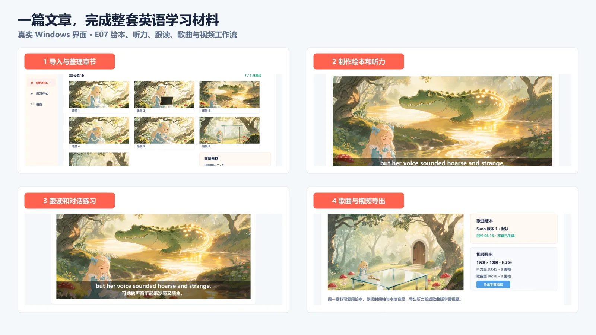
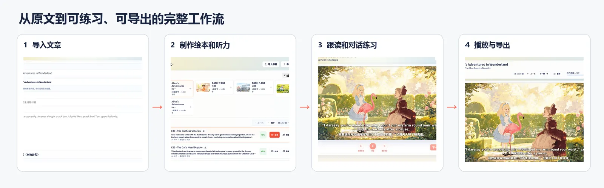
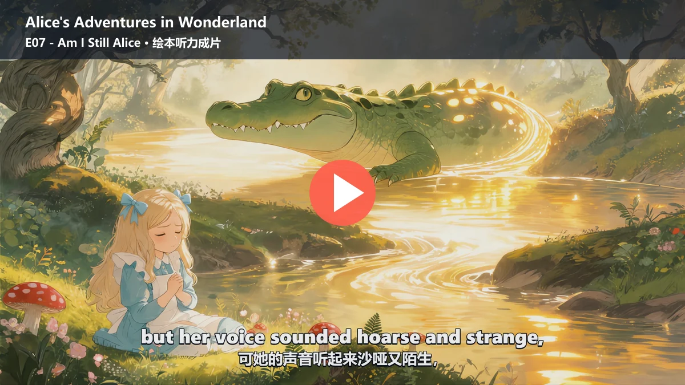
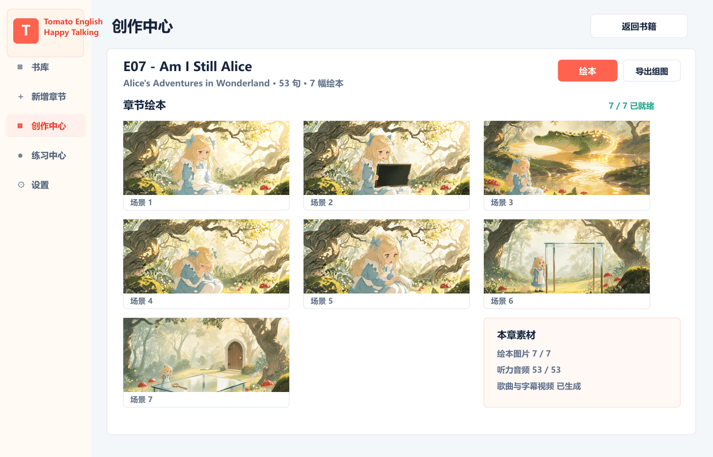
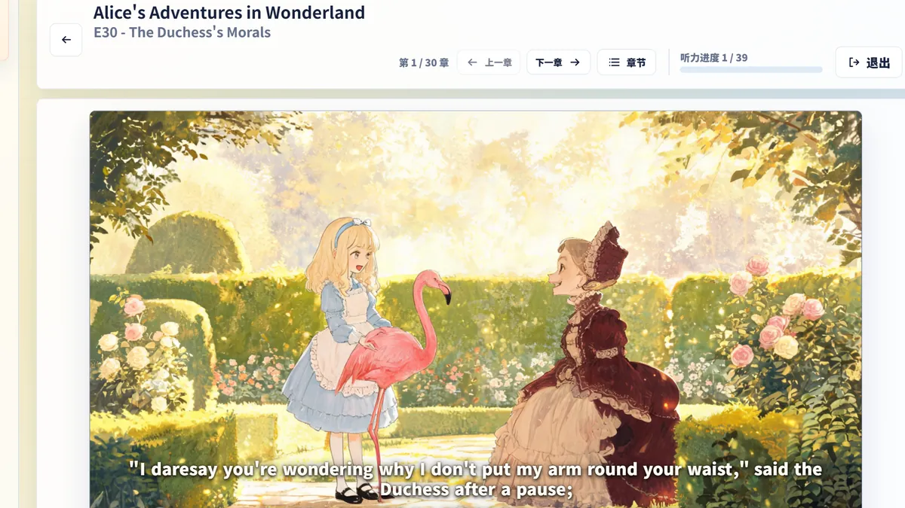
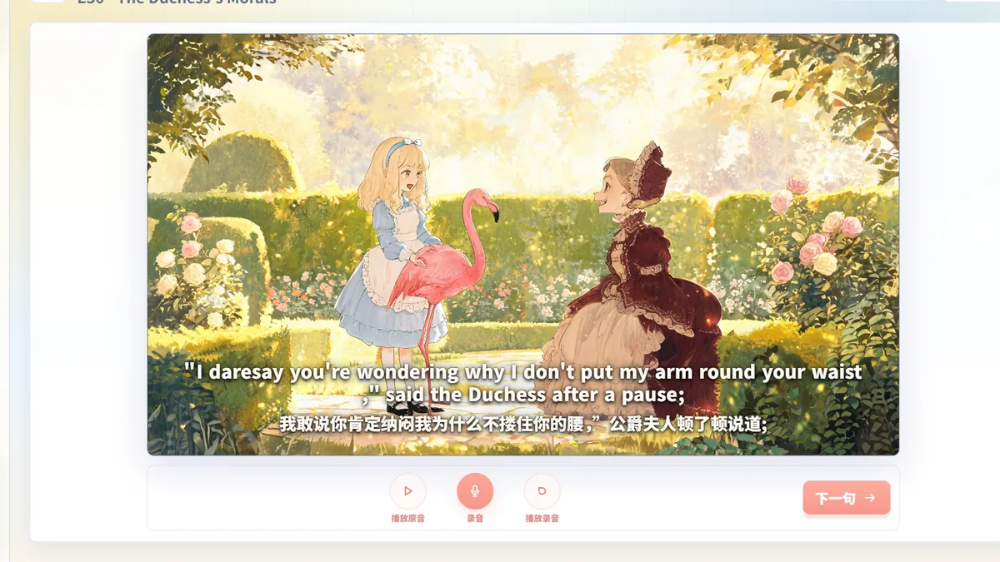
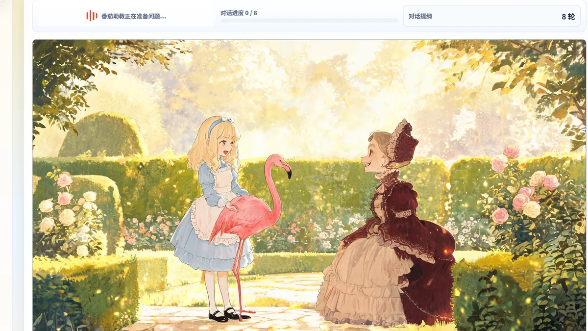
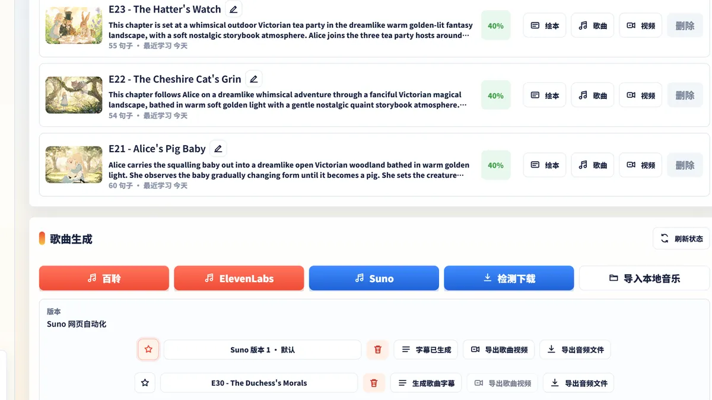
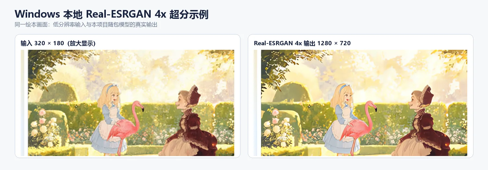

  
  <h1>Tomato English Happy Talking</h1>
  
<strong>把一篇英文或中英文章，变成可以听、读、说和分享的英语学习材料。</strong>

  
面向家长和教师的本地优先英语内容制作工具，支持 Windows 与 Android。

  

    <a href="README.md">简体中文</a> ·
    <a href="README.en.md">English</a>
  

  

    
    
    
    
  

  

    <a href="https://github.com/70565912/TomatoEnglishHappyTalking/releases/latest"><strong>下载 Windows ZIP / Android APK</strong></a>
    · <a href="https://github.com/70565912/TomatoEnglishHappyTalking/issues/new/choose">报告问题或建议</a>
  

## 最新版本 · v1.6.0 英文朗读分句 V3.8（2026-08-16）

Tomato 已将面向 TTS、字幕、听力定位和跟读的英文朗读分句器重构为一次不可变事实构建与一次有界
DAG 求解，并升级内部求解器为 `syntax_solver_v3_8`。

- Alice 39 章与 Willows 62 章共 101 章、2,927 个正字句完成固定语料门禁；相对最近接受基线的
  27 个变化原句全部通过统一规范审核，不支持变化 0、未分类变化 0。
- 最终生成 7,967 个朗读句段，原文回拼失败 0、超过 30 词的句段 0，最长句段 27 词；Windows
  原生 243 项评测中，人工认可路径覆盖 243/243，解析器健康且没有紧急原句输出。
- 在同机、同冻结输入的 AOT 交替回放中，三个代表章节相对重构前实现的中位耗时降低约
  70%–92%；事实、候选、评分和求解职责已经收敛到唯一生产链路。

> 已发布文章继续使用持久化句槽，不会因算法升级自动重分；新建文章或用户显式重建后才使用新求解器。

[查看完整生产整合与验证报告](docs/archive/read_aloud_splitter_v4_production_integration_20260816.md) ·
[查看英文朗读分句统一规范](docs/read_aloud_sentence_split_spec.md) ·
[查看全部测试与评测](docs/testing-and-evaluation.md)

## 从文章到完整学习材料

1. **导入文章**：粘贴英文或中英对照内容，按书籍和章节保存。
2. **制作素材**：审核绘本分镜，生成组图和逐句听力，也可以制作或导入歌曲。
3. **开始练习**：孩子可以进行绘本听力、逐句跟读、识别评分和章节对话。
4. **导出分享**：导出听力或歌曲视频，并选择 SRT 字幕或内嵌字幕。

[使用问题](https://github.com/70565912/TomatoEnglishHappyTalking/discussions) · [功能建议](https://github.com/70565912/TomatoEnglishHappyTalking/issues/new/choose) · [查看路线图](ROADMAP.md)

## 公开作品案例

下图来自 Tomato 为 E07 `Am I Still Alice` 本地导出的真实 1080p 内嵌中英字幕视频。点击封面可打开《爱丽丝梦游仙境（原著领唱版）》完整作品集。

**[查看 41 集完整作品集](https://wap.qupeiyin.cn/app/v736/albumShare?shareUid=MDAwMDAwMDAwMLGdxGaAscyUsbeEcg&albumId=MDAwMDAwMDAwMLCHpmKAsa7e)** · [趣配音 E03 完整版](https://movie.qupeiyin.com/home/share/original_video/app/1/course/MDAwMDAwMDAwMLCHxKqCe7rdsMp0cg/uid/MDAwMDAwMDAwMLGdxGaAscyUsbeEcg) · [趣配音 E09 完整版](https://movie.qupeiyin.com/home/share/original_video/app/1/course/MDAwMDAwMDAwMLCHxKuCe67bsKR0cg/uid/MDAwMDAwMDAwMLGdxGaAscyUsbeEcg)

《爱丽丝梦游仙境（原著领唱版）》已经使用 Tomato 制作并发布为 41 个连续学习视频，可在[英语趣配音移动端作品集](https://wap.qupeiyin.cn/app/v736/albumShare?shareUid=MDAwMDAwMDAwMLGdxGaAscyUsbeEcg&albumId=MDAwMDAwMDAwMLCHpmKAsa7e)查看。趣配音链接由第三方平台承载，页面可用性和播放方式以平台当前规则为准。

## 适合谁

- 想把孩子正在读的英文故事制作成绘本听力的家长。
- 需要把自有文章整理成课堂听说材料的英语教师。
- 希望保留本地书库、音频、图片和视频，不依赖自建后端的个人用户。
- 愿意自行申请并承担云 AI 服务费用、需要控制模型与素材版本的进阶用户。

## 有什么不同

Tomato 不是预置固定课程的闯关 App。它围绕你自己的文章建立一条完整内容链路：持久化分句、逐句翻译、绘本分镜审核、听力、跟读、章节对话、歌曲和视频导出都归属于同一本书和章节。已经生成的成功素材优先从本地缓存复用，减少重复云调用。

## 主要能力

- 导入英文或中英对照文本，并保存为书籍章节。
- 审核整章绘本提示词后，按顺序生成连续分镜组图。
- 生成并缓存逐句英文 TTS，支持绘本全屏听力播放。
- 跟读录音、语音识别和基于识别结果的发音评分。
- 基于当前章节内容开展英语对话练习。
- 生成或导入歌曲，并根据 ASR 时间生成歌词字幕时间轴。
- 导出听力或歌曲视频，支持 SRT 和内嵌字幕。
- Windows 可使用随包提供的 Real-ESRGAN NCNN Vulkan 进行本地 2x/4x 绘本超分。

## 平台支持

| 能力 | Windows | Android |
| --- | :---: | :---: |
| 书库、章节与创作中心 | ✅ | ✅ |
| 绘本、听力、跟读与对话 | ✅ | ✅ |
| 歌曲与字幕视频工作流 | ✅ | ✅ |
| 本地 Real-ESRGAN 绘本超分 | ✅ 需要 Vulkan | 暂不支持 |
| GitHub 发布包 | ZIP | APK（当前为测试签名侧载版） |

## 使用前须知

- 本项目不提供云账号或 API Key。文本、图片、TTS、ASR、实时对话和歌曲能力按所选服务商实际计费。
- Windows/Android 客户端直接调用你配置的云服务，不需要部署 Tomato 私有后端。
- 文章、数据库、下载素材、生成图片、音频、视频、缓存、日志和设置保存在本机。
- Release 不包含开发者账号、API Key、本地数据库、缓存、日志或用户生成内容。
- Suno 使用系统浏览器手动生成和下载，再回到创作中心导入本地 MP3。

完整申请和配置步骤见 [云服务配置指南](docs/cloud-service-setup.md)。

## 下载与安装

前往 [最新 Release](https://github.com/70565912/TomatoEnglishHappyTalking/releases/latest)：

- **Windows**：下载 `tomato_english_happy_talking-windows-*.zip`，解压后运行 `tomato_english_happy_talking.exe`。需要 Microsoft Edge WebView2 Runtime；本地超分还需要支持 Vulkan 的显卡。
- **Android**：下载 `tomato_english_happy_talking-android-*.apk` 后侧载安装。当前公开 APK 使用项目测试签名，不是应用商店正式签名。
- 发布页提供 SHA-256 校验清单时，可在安装前核对下载文件完整性。

## 更多界面

| 创作中心 | 听力与绘本 |
| --- | --- |
|  |  |

| 跟读练习 | 章节对话 |
| --- | --- |
|  |  |

歌曲生成、字幕与视频/音频导出：

## 作者与缘起

- 作者：兔子先生 / Ryan Chen
- 邮箱：[70565912@qq.com](mailto:70565912@qq.com)

这款应用最初是兔子先生为自家的「番茄」小朋友制作的 AI 英语学习工具。最初的愿望很直接：把孩子正在阅读的任意文章自动制作成英文绘本视频，同时支持日常听力和口语练习。项目后来逐步扩展为围绕书籍、章节、绘本、听力、跟读、对话、歌曲和视频导出的完整工作台。

## 本地与云端边界

| 范围 | 处理方式 |
| --- | --- |
| 书库、分句、翻译映射和素材索引 | 本地 SQLite |
| API Key | 本机安全存储；桥接只返回脱敏状态 |
| 图片超分 | Windows 本地 Real-ESRGAN NCNN Vulkan |
| 文本、图片、TTS、ASR、实时对话 | 按设置调用阿里云或火山引擎 |
| Suno 歌曲 | 系统浏览器手动流程后导入本地文件 |
| 导出与诊断 | 本机文件系统 |

## 公开评测与技术选型

Tomato 不只保存“测试通过”的结论，也公开失败样本、淘汰方案、重复测试和适用边界，供英语
NLP、Flutter 端侧 AI、字幕对齐和内容生成方向的研发人员复现与选型。

| 评测 | 有参考价值的结论 | 报告 |
| --- | --- | --- |
| 文本模型受约束句法任务 | 阿里 `qwen3.7-max`（P7）和火山 `DeepSeek V4 Flash`（P8）均连续三轮 30/30；豆包 Lite/Pro 未达到生产门槛，Lite 的 5 种争议路径经人工审核全部判错 | [分句 V3.3 验收](docs/read_aloud_sentence_split_v3_3_implementation_report.md) · [Lite 人工审核](docs/volcengine_doubao_lite_sentence_split_human_review.md) |
| UDPipe / Stanza / spaCy | 10 个困难主谓 root probe 中 Stanza 10/10、官方 UDPipe 参考模型 8/10、spaCy 7/10；生产 UDPipe 用作软结构证据而非唯一裁判 | [句法器对比评测](docs/parser-comparison-evaluation.md) |
| 绘本章节规划 Prompt | 四类文章最终 12 次响应结构失败为 0；说明文 scene 数标准差由 2.49 降至 0.47，但措辞和边界仍需人工审核 | [分镜调优报告](docs/picture_book_chapter_plan_scene_split_tuning.md) |
| 本地字幕对齐 / BigASR | MMS CTC 在英文 3/4 样本上是可替代候选，平均 CPU RTF 约 0.88；长 Suno 难例仍需 BigASR 兜底 | [评测总览](docs/archive/ctc_forced_aligner_subtitle_eval_20260801/README.md) · [Round 1](docs/archive/ctc_forced_aligner_subtitle_eval_20260801/reports/summary.md) · [Round 2](docs/archive/ctc_forced_aligner_subtitle_eval_20260801/reports/summary_round2.md) |
| 真实 ASR 快照回归 | E03/E07/E13/E16 固化缺词、重复词和弱锚点故障，离线复测字幕 DP，不重复调用收费 ASR | [方法与证据索引](docs/testing-and-evaluation.md#5-真实-asr-时间轴快照回归) |
| Windows/WebView/Bridge QA | App 内 Suno Lexical 键盘输入故障被隔离到 WebView2 链路；`article.list` 从 62,752,595 B 降到 64,485 B | [Suno 隔离报告](docs/suno_lexical_lyrics_editor.md) · [Bridge/Release QA](docs/bridge-payload-release-qa-evaluation.md) |

**[查看全部测试与评测报告、方法、过程、局限和复现入口](docs/testing-and-evaluation.md)**

分句成绩可反映英文结构理解和严格指令遵循能力，对翻译与分镜模型选型有参考意义；但它不是
翻译忠实度或视觉叙事质量的直接替代指标。所有排名只适用于报告中的模型 ID、协议和样本。

### 可直接观察的超分 A/B

同一张 E07 绘本画面：上方完整画面标出两个检查区域，下方分别放大爱丽丝面部/发丝和
鳄鱼眼睛/牙齿。左右使用完全相同的画面范围；输入侧以最近邻显示原始像素，右侧是 Windows
发布包随附 `Real-ESRGAN NCNN Vulkan` 4x 模型的真实输出。点击图片可查看 1800px 原图。

[原始 320×180 输入 PNG](docs/readme/upscale-evidence/input-320x180.png) ·
[真实 1280×720 输出 PNG](docs/readme/upscale-evidence/output-1280x720.png)

这是直观效果与链路验证，不是多模型感知质量排名。

## 文档

- [用户指南与截图](docs/user-guide/)
- [云服务配置](docs/cloud-service-setup.md)
- [开发与构建指南](docs/development-guide.md)
- [AI CLI / QA 远程调用指南](docs/ai_cli_qa_remote_guide.md)
- [测试与评测报告](docs/testing-and-evaluation.md)
- [英文依存句法器对比评测](docs/parser-comparison-evaluation.md)
- [Flutter/Web Bridge 负载与 Release QA 评测](docs/bridge-payload-release-qa-evaluation.md)
- [变更记录](docs/change_log.md)
- [路线图](ROADMAP.md)
- [贡献说明](CONTRIBUTING.md)
- [安全政策](SECURITY.md)

## 技术与致谢

主应用使用 [Flutter](https://github.com/flutter/flutter)，Web UI 使用 React、Vite 和 TypeScript。项目还使用或集成了 [Real-ESRGAN](https://github.com/xinntao/Real-ESRGAN)、[ncnn](https://github.com/Tencent/ncnn)、[FFmpeg](https://github.com/FFmpeg/FFmpeg)、[flutter_inappwebview](https://github.com/pichillilorenzo/flutter_inappwebview) 和 [just_audio](https://github.com/ryanheise/just_audio) 等开源项目。第三方组件、模型、字体和媒体仍遵守各自许可证与使用条款。

## 参与项目

普通用户可以在 [Discussions](https://github.com/70565912/TomatoEnglishHappyTalking/discussions) 提问或展示作品，在 [Issue Forms](https://github.com/70565912/TomatoEnglishHappyTalking/issues/new/choose) 报告问题和提出建议。提交前请删除 API Key、账号、本机路径、数据库和未脱敏日志。

如果 Tomato 对你的家庭学习或教学准备有帮助，可以为仓库点一个 Star，让更多有相同需求的人看到它。

## License

项目以 [Apache License 2.0](LICENSE) 开源。云服务、第三方模型、字体、媒体以及用户生成内容仍各自遵守其原有条款。
