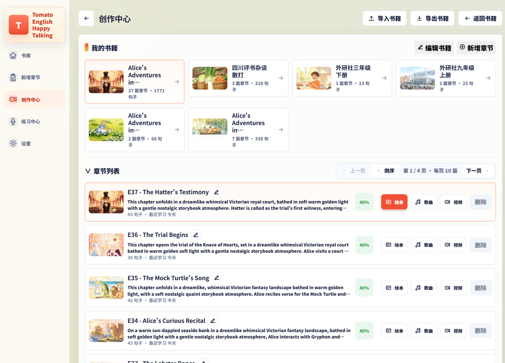
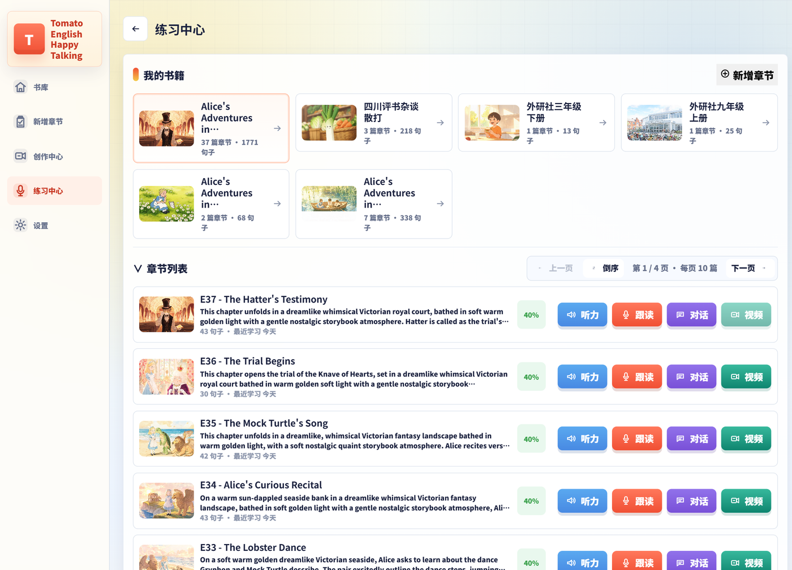

# Tomato English Happy Talking

[English](README.md) | [中文](README.zh-CN.md)

Tomato English Happy Talking 是一款独立 Flutter 应用，用 AI 辅助英语听力、跟读、绘本、歌曲和视频练习。

无需自建后端：Windows / Android 客户端直接调用已配置的云 AI 服务；学习内容、生成素材、播放缓存、诊断日志与用户设置都保存在本机。

项目以 Apache License 2.0 开源，详见 [LICENSE](LICENSE)。云服务、第三方模型、字体、媒体以及用户生成内容仍各自遵守其原有条款。

## 作者与缘起

- 作者：兔子先生 / Ryan Chen
- 邮箱：[70565912@qq.com](mailto:70565912@qq.com)

这款应用最初是兔子先生为自家的「番茄」小朋友做的用于练习英语的 AI 英语学习工具。设计目标是希望可以用任意文章自动制作出英文学习用的英语绘本视频，并可以用于日常的英语听力 / 口语练习。因为有 AI 接口调用，所以需要去申请对应的 AI 接口 API Key，并配置到软件中才能正常使用。后面附有说明申请地址与配置步骤。

## 功能概览

- 导入英文或中英对照文本，保存为书籍章节。
- 以「书库 / 章节 / 听力 / 跟读 / 对话」组织练习材料。
- 全章绘本分镜：先提示词审核，再顺序生成组图。
- 可为章节歌词生成或导入歌曲版本，并用 ASR 时间戳做字幕时间轴。
- 章节听力播放（本地 TTS 缓存），支持绘本全屏播放。
- 跟读录音，并基于识别结果做发音启发式评分。
- 基于章节内容的英语对话练习。
- 导出听力 / 歌曲视频（SRT 或烧录字幕）。
- 设置保存在本机；Flutter / Web 桥接不回传明文 API Key。

## 界面预览

创作中心：按章节管理绘本、歌曲与视频导出。



练习中心：按书籍进入听力、跟读与对话练习。



## 下载

正式发布包见 GitHub Releases：

- [最新 Release](https://github.com/70565912/TomatoEnglishHappyTalking/releases/latest)
- Windows zip 与 Android APK 会随版本号上传，例如 `v1.0.0`

## 申请并配置 API Key

本仓库**不包含**任何云服务密钥。下载安装后，请在 App 内 **设置 → 云服务** 填写 Key（界面只保存密文 / 脱敏 mask，不会经 bridge 回传明文）。云调用会产生费用，开通前请阅读各平台计费说明。

### 需要哪些 Key


| 设置项里的名称    | 用途                                     | 是否必填                |
| ---------- | -------------------------------------- | ------------------- |
| **百炼 Key** | 默认走阿里云时：文本生成、绘本组图、TTS、ASR、百聆歌曲等        | 使用阿里云路径时必填（默认平台）    |
| **方舟 Key** | 切换到火山引擎时：文本（方舟）、Seedream 绘本组图          | 使用火山文本 / 图片时必填      |
| **语音 Key** | 火山 TTS / BigASR；对话练习依赖火山 Realtime 语音链路 | 使用火山语音、跟读识别或对话练习时必填 |


建议起步：先申请并配置 **百炼 Key**，即可体验导入章节、绘本、听力和多数创作流程。若要用火山平台能力，或使用对话练习，再补 **方舟 Key** 与 **语音 Key**。

Suno 歌曲不在 App 内填 Key：设置里选 Suno 后，会打开系统浏览器，用你自己的 Suno 账号手动生成并下载，再回到创作中心「导入本地音乐」。

### 申请地址

1. **阿里云百炼（DashScope）API Key**
  - 控制台：[百炼 API Key 管理](https://bailian.console.aliyun.com/?tab=model#/api-key)  
  - 说明：[如何获取 API Key](https://help.aliyun.com/zh/model-studio/get-api-key)  
  - 创建后立即复制保存；关闭弹窗后通常无法再看明文。
2. **火山方舟 API Key**
  - 控制台：[方舟 API Key](https://console.volcengine.com/ark/region:ark+cn-beijing/apiKey)  
  - 需开通方舟及要用的文本 / 图片模型（如 Seedream 组图）。
3. **火山语音 API Key（新版控制台）**
  - 控制台：[豆包语音 · API Key 管理](https://console.volcengine.com/speech/new/setting/apikeys)  
  - 说明：[控制台 API Key 管理](https://www.volcengine.com/docs/6561/2119699)  
  - 本应用使用新版 `X-Api-Key` 鉴权；开通 TTS / ASR / Realtime 等相关服务后再调用。

### 在软件里怎么配置

1. 安装并打开 App（Windows 或 Android）。
2. 进入 **设置 → 云服务**。
3. 在 **凭据** 区分别粘贴：**百炼 Key**、**方舟 Key**、**语音 Key**（按你实际要用的平台填写；不用的可以留空）。
4. 确认默认 **平台** 选择：需要阿里云路径时选阿里云百炼；需要火山文本 / 图片 / 语音路径时切到火山引擎，并保证对应 Key 已填。
5. 保存设置。之后新生成 / 新下载的云结果才会按当前平台与模型计费调用；本地已有缓存会优先复用。

不要把 Key 写进仓库、截图、Issue 或日志。本机 Windows 发布目录里的 `security/`、`settings.json` 等也不要打进对外 zip。

## 当前平台

- Windows 桌面版：`tomato_english_happy_talking.exe`
- Android APK：`com.example.tomato_english_happy_talking`

主界面是打包进 App 的 React / Vite WebView。Flutter 负责本地存储、安全配置、录音、播放、TTS、ASR、云调用和文件导出等原生能力。

## 架构

```text
TomatoEnglishHappyTalking/
├── app/                  # Flutter 应用
│   ├── lib/              # Dart 源码
│   ├── assets/web/       # 打包进 App 的 Web UI
│   ├── android/          # Android 工程
│   └── windows/          # Windows 工程
├── web_ui/               # React + Vite + TypeScript UI
├── tools/                # 构建与本机自动化脚本
├── docs/                 # 设计说明、迁移说明与变更记录
├── README.md             # English
└── README.zh-CN.md       # 中文
```

运行时链路：

```text
React/Vite Web UI
        |
        | 类型化 bridge 命令 / 事件
        v
Flutter WebShellScreen
        |
        +-- Riverpod providers
        +-- 本地 SQLite 与安全存储
        +-- 录音 / 播放服务
        +-- 云 AI 客户端
        +-- 导出与诊断工具
```

## 云服务

文本、图片、语音、ASR、歌曲可按设置选择不同供应商路径：


| 能力   | 支持路径                                  |
| ---- | ------------------------------------- |
| 文本生成 | 阿里云百炼 OpenAI 兼容 Chat Completions、火山方舟 |
| 绘本组图 | 阿里云万相顺序组图、火山 Seedream 顺序组图            |
| TTS  | 阿里云 CosyVoice、火山 Doubao TTS 2.0       |
| ASR  | 阿里云 Qwen-ASR、火山 BigASR                |
| 实时对话 | 火山 Realtime 对话                        |
| 歌曲生成 | 阿里云百聆 Fun-Music；Suno 走系统浏览器手动流程后本地导入  |


仓库不包含 API Key。请在本机 App 设置页填写。不要提交密钥、导出诊断、本地数据库、生成媒体或发布目录里的运行数据。

## 环境要求

仓库主要在 Windows 上开发；其它环境可能可用，但发布脚本以 PowerShell 为主。

- Flutter stable SDK
- Flutter 自带的 Dart SDK
- Node.js 与 npm（用于 `web_ui/`）
- Android SDK（打 APK）
- Microsoft Edge WebView2 Runtime（Windows 客户端）
- FFmpeg（Windows 包内用于音视频导出）

原开发机使用 `D:\DevTools\flutter` 与 `D:\Android\SDK`，这只是本机约定，不是仓库硬性要求。

## 快速开始

安装 Flutter 依赖：

```powershell
cd app
flutter pub get
```

安装并构建 Web UI：

```powershell
cd web_ui
npm install
npm run build
```

在仓库根目录构建 Windows 应用：

```powershell
.\tools\build_windows.ps1 -Release
```

构建 Android Release APK：

```powershell
.\tools\build_android.ps1
```

本机发布 GitHub Release（构建 Windows + Android，打干净 zip，打 tag `vX.Y.Z` 并上传产物）：

```powershell
.\tools\publish_github_release.ps1 -Version 1.0.0
```

可用 `-SkipBuild` 复用已有构建产物，或用 `-Draft` 创建草稿 Release。不要直接压缩 `release/windows/tomato_english_happy_talking/`；发布脚本会在 `release/dist/` 下做干净暂存包。

运行 Web UI 测试：

```powershell
npm --prefix web_ui test
```

运行 Flutter 分析：

```powershell
cd app
flutter analyze
```

## 构建脚本

### `tools/build_windows.ps1`

- 先构建并打包 Web UI，再构建 Flutter。
- 支持 Debug / Release，可选 `-Run`。
- 将可运行 Windows 程序同步到 `release/windows/tomato_english_happy_talking/`。
- 开发期会保留该目录下的本机运行数据。

### `tools/build_android.ps1`

- 构建 Android Release APK。
- 复制到 `release/android/`。
- 可按参数在已连接设备 / 模拟器上跑 Debug 或 Release。

### `tools/publish_github_release.ps1`

- 默认构建 Windows Release 与 Android Release APK（`-SkipBuild` 可跳过）。
- 从 `app/build/windows/x64/runner/Release` 加 FFmpeg 做干净 Windows zip，写入 `release/dist/`，排除本机运行数据与密钥。
- 将版本化 APK 复制到 `release/dist/`。
- 创建 annotated tag `vX.Y.Z`，推送并用 `gh release create` 上传两个产物。

冷构建 Android Release 可能超过 15 分钟（Gradle、插件、R8、资源与 mapping）。自动化超时请留足余量。

## 发布与数据安全

本机 Windows 发布目录同时也是开发运行目录，可能含有日志、诊断、数据库、API 缓存、导出视频、导入歌曲、生成音频和旧配置。

对外分发时不要直接压缩该目录。应只保留可执行文件、DLL、Flutter `data/`、FFmpeg 及必需运行库。至少排除：

- `logs/`
- `diagnostics/`
- `recording-export/`
- `suno-music/`
- API 缓存目录
- SQLite 数据库
- `security/`
- settings 文件
- 任意 API Key / Token 材料

## 开发约定

- Flutter Service 与 UI 状态分离。
- Web UI 必须通过类型化 bridge 协议与 Flutter 交互。
- 云调用优先本地解析、本地缓存和已有业务数据，避免重复付费请求。
- 只缓存成功的真实远程结果；不要把 API Key、失败响应、mock fallback 或含敏感信息的诊断当可复用缓存。
- 产品心智是「书籍 / 章节」工作台，不是游戏大厅或奖励闯关。

更多实现细节见 [docs/](docs/)，尤其是变更记录、迁移说明、提示词审核与构建发布踩坑文档。

## 许可证

Apache License 2.0，详见 [LICENSE](LICENSE)。